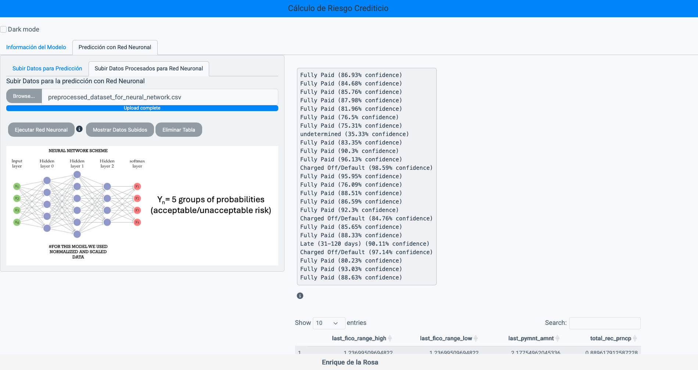

# 🧠 Final Master's Project – Credit Risk Prediction with Neural Network

Welcome to my final Master's project! This repository showcases an **interactive Shiny App** powered by a **Neural Network model** for **predicting credit risk** based on customer data. The goal is to provide a robust tool for financial risk analysis through real-time interactivity and machine learning.

---

## 🚀 Main Features

- 🔍 **Credit Risk Prediction** using a trained neural network model
- 📊 **Interactive interface** built with Shiny for real-time data input and results
- 🧠 **Deep learning model (.h5)** trained with real-world financial features
- 📁 Easily reproducible with included datasets and model
- 📉 Full analysis documented in R Markdown (`markdown_credit_risk.html`)

---

## 📂 Project Structure

├── app.R # Main Shiny app script

├── neural_network_model_TFM_2.h5 # Trained neural network model

├── www/ # Folder for static assets (e.g. screenshots)


---

## 🖼️ App Preview



---

## ⚙️ Requirements

Make sure you have **R >= 4.0** installed and the packages and versions of the files `requirements.txt` and `manifest.json`.
Main libraries:

```r
install.packages("shiny")
install.packages("tidyverse")
install.packages("reticulate")
install.packages("rmarkdown")
```

To use the neural network model:

```r
install.packages("keras")
library(keras)
install_keras()
```

▶️ How to Run the App
Clone this repository:

```bash
git clone https://github.com/Enriquedlrm16/Final-Master-Project.git
```

Open R or RStudio and run:
```r
shiny::runApp('app.R')
```

📝 License

This project is released under the MIT License – feel free to use, modify, and share with credit.

🙌 Acknowledgments

Thanks to my professors, mentors, and peers for their guidance during this project. Special appreciation to open-source contributors and the R/Shiny community.


